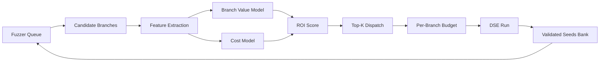

# System Architecture (v1)

```mermaid
flowchart LR
    A[Fuzzer Queue] --> B[Candidate Branches]
    B --> C[Feature Extraction]
    C --> D[Branch Value Model]
    C --> E[Cost Model]
    D --> F[ROI Score]
    E --> F
    F --> G[Top-K Dispatch]
    G --> H[Per-Branch Budget]
    H --> I[DSE Run]
    I --> J[Validated Seeds Bank]
    J --> A
```
